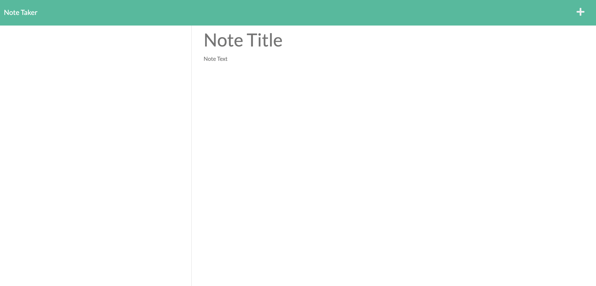

# Note Taker Application
</img>
<br>

## Table of Contents
  1. [Description](#description) 
  2. [Installation](#installation)
  3. [Usage](#usage)  
  4. [Contributing](#contributing)
  5. [Tests](#tests)
  6. [License](#license)
  7. [Questions](#questions)
  8. [E-mail](#e-mail)

## Description
This application was built using NodeJS and is designed to allow users to create, store and read notes from a database. This application also uses the expressJS routers to send the pages when requested, as well as store and fetch note data. 

## Installation
This application requires NodeJS to be installed in order to run. To run the application using Node.Js, navigate to the application directory in the terminal. In the terminal window for the application directory, install the node packages by typing: ```npm install```

## Usage
To run the application open the application directory in the terminal. After installing the application in the previous step, to run the application just type: ```node server.js``` in the terminal window. after the application is running, open your default browser and navigate to the site ```https://localhost:3540``` and the server should respond with the landing page for the application. To stop the process from running, open the terminal window where it is running and type: ```cmd + c``` or ```ctrl + c```

## Contributing
This project is not open to contributions.

## Tests
There are no tests designed for this application.

## License


## Questions

Github Profile: [dubosews](https://github.com/dubosews)
Contact Email: [wsd10205@gmail.com](mailto:wsd10205@gmail.com)
Directions for reaching out with further questions:
    If you would like to reach out to me, feel free to do so through github, or by emailing me at the address included.
